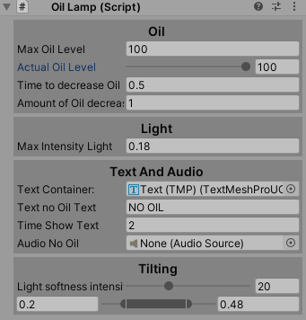

# OilLamp

:diya_lamp: Oil lamp that can be turned on and off with the Q key by default. 
A small flicker of the light has been programmed for more realism. 

If no oil is available, it will be indicated by a message

An editor has been created to facilitate setup and testing

:link: Copyright :link:

All the scripts and models in this repository have been created by me and should not be used for commercial or personal projects without permission and without attribution
